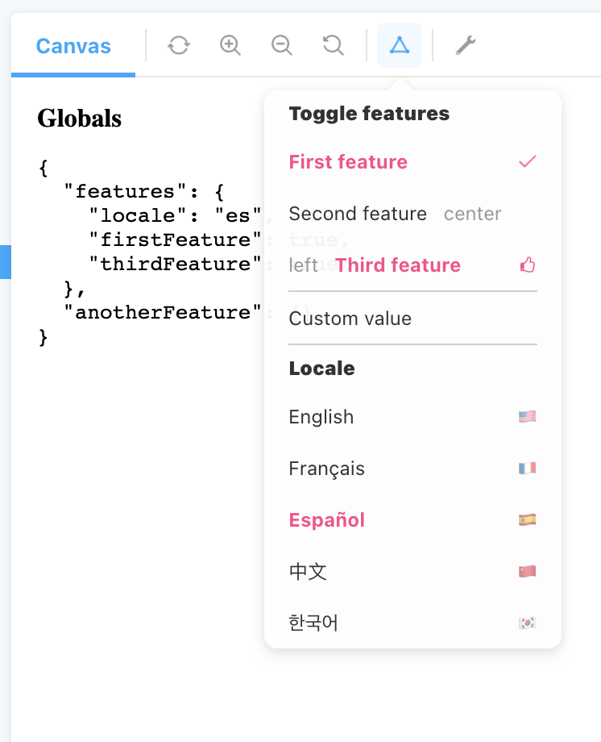

# storybook-multi-toolbar

Storybook addon to define multiple toggleable toolbar items.



# Setup

```bash
npm install --save-dev storybook-multi-toolbar
```

Register addon in `.storybook/main.js`

```javascript
module.exports = {
  // ...
  addons: [
    'storybook-multi-toolbar',
    // ...
  ],
};
```

Define menu items `.storybook/preview.js`

```javascript
export const parameters = {
  multiToolbar: {
    toolbars: [
      {
        param: 'features',
        name: 'Features',
        lists: [
          // toggleable menu items
          {
            type: 'toggle',
            title: 'Toggle features',
            items: [
              { param: 'firstFeature', title: 'First feature' },
              { param: 'secondFeature', title: 'Second feature' },
              { param: 'thirdFeature', title: 'Third feature' },
            ],
          },
          // normal menu items
          {
            title: 'Locale',
            param: 'locale',
            items: [
              { value: 'en', right: '🇺🇸', title: 'English' },
              { value: 'fr', right: '🇫🇷', title: 'Français' },
              { value: 'es', right: '🇪🇸', title: 'Español' },
            ],
          },
        ],
      },
    ],
  },
};
```

See more examples in [preview.ts](./.storybook/preview.ts) and parameter structure in [types.ts](src/types.ts)